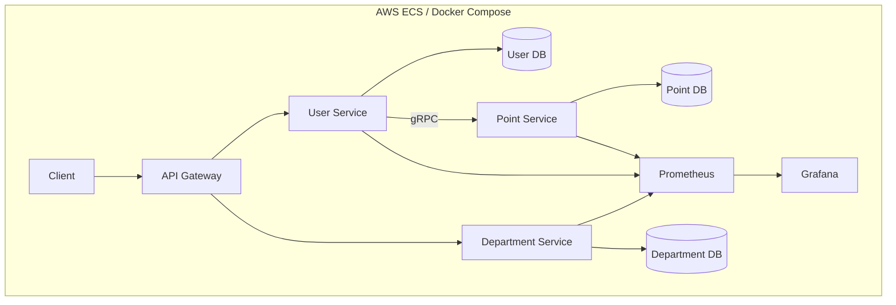

# Distributed Microservices Demo in Go

A cloud-native, production-ready demonstration of a distributed system built with Go. This project features three containerized microservices (REST & gRPC) communicating over a network, backed by PostgreSQL, deployed via CI/CD to AWS ECS, and fully monitored with Prometheus and Grafana.

# Demo
**Run Locally:**
```bash
make run_docker
```
Prerequisites: Docker and Docker Compose must be installed on your machine.


# Architecture Overview



# Technology Stack 
Go, PostgreSQL, Docker, gRPC, Prometheus, Grafana, GitHub Action

# Key Features

### 🏗️ Architecture & Design Patterns
This project is a textbook example of practical software engineering patterns in Go:
* **Concurrency Pattern:**
    * Utilized in [service/user_service/user/user_service](https://github.com/syedomair/backend-microservices/blob/main/service/user_service/user/user_service.go) to execute multiple database queries and gRPC calls concurrently using Go's `errgroup`.
    * Enhances the performance of the `GetAllUserStatistics` method by leveraging parallel processing.
* **Dependency Injection Pattern:**
    * Utilized in [lib/container/container.go](https://github.com/syedomair/backend-microservices/blob/main/lib/container/container.go) to manage logging, database connections, and environment variables.
    * Promotes modularity and flexibility by injecting dependencies into a central container.
* **Singleton Pattern:**
    * Implemented in [lib/container/container.go](https://github.com/syedomair/backend-microservices/blob/main/lib/container/container.go) through synchronized lazy initialization (`sync.Mutex` + instance check) in `PostgresAdapter` and `MySQLAdapter`.
    * Ensures only one database connection instance is created per adapter while maintaining thread safety.
* **Adapter Pattern:**
    * Used in [lib/container/container.go](https://github.com/syedomair/backend-microservices/blob/main/lib/container/container.go) to create a unified database interface (`Db`) with concrete implementations (`PostgresAdapter` and `MySQLAdapter`).
    * Enables seamless switching between database providers without modifying client code.
* **Factory Pattern:**
    * Utilized in [lib/container/db.go](https://github.com/syedomair/backend-microservices/blob/main/lib/container/db.go) through the `NewDBConnectionAdapter` function.
    * Acts as a factory method to create instances of different database adapters based on the specified database type, encapsulating object creation logic.
* **External Configuration Pattern:**
    * Utilized in [lib/container/container.go](https://github.com/syedomair/backend-microservices/blob/main/lib/container/container.go) to manage and validate essential configuration through environment variables.
    * Ensures centralized and type-safe access to settings, promoting flexibility and ease of deployment.
* **Decorator Pattern:**
    * Utilized in [lib/response/response.go](https://github.com/syedomair/backend-microservices/blob/main/lib/response/response.go) to dynamically add behaviors to response handlers.
    * Allows setting headers or handling different response types without altering the underlying handler implementation.
* **Middleware Pattern:**
    * Utilized in [lib/router/router.go](https://github.com/syedomair/backend-microservices/blob/main/lib/router/router.go) to chain multiple handlers that add functionalities like logging, request ID management, and Prometheus metrics collection.
    * Enhances the HTTP request processing pipeline with modular and reusable components.
* **Object Pool Pattern:**
    * Implemented in [lib/container/connection.go](https://github.com/syedomair/backend-microservices/blob/main/lib/container/connection.go) to manage a pool of reusable gRPC client connections.
    * Optimizes resource usage and improves performance by reducing the overhead of repeatedly creating and destroying connections.
    
### 🚀 Operational Excellence
*   **CI/CD:** Automated Docker image builds and deployments to AWS ECS via GitHub Actions.
*   **Monitoring:** Integrated Prometheus metrics and pprof profiling for real-time performance insight.
*   **Observability:** Structured logging and request tracing throughout the services.
*   **Containerization:** Fully dockerized for local development and cloud deployment.


### 🧪 Testing Strategy
*   **Unit Tests:** Comprehensive tests for all business logic and handlers.
*   **Integration Tests:** End-to-end tests using a live test database and gRPC server within Docker, validating the entire service ecosystem.

### 📡 APIs & Communication
*   **RESTful APIs:** JSON over HTTP for `user-service` (`/users`) and `department-service` (`/departments`).
*   **gRPC:** High-performance RPC for internal communication between `user-service` and `point-service`.

---

# Conclusion
This microservices architecture not only demonstrates best practices in software design but also incorporates essential features for modern application development, such as CI/CD, performance monitoring, and robust testing frameworks. By leveraging these technologies, developers can build scalable, maintainable, and high-performing applications.
